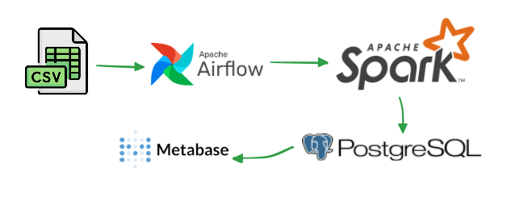

# Building a Customer-Centric Retail Data Mart for Behavioral Analysis

## 1. Project Overview

Many traditional retail stores generate a significant volume of daily transaction data. However, this data often remains archived as administrative records and is not fully leveraged to understand key business drivers: **customer behavior and shopping patterns**. Consequently, strategic decisions like product placement, promotional bundling, and customer loyalty programs are often based on intuition rather than measurable data.

The main objective of this project is to build a **data insights platform** capable of processing raw transaction data into two key strategic insights: **Market Basket Analysis** and **RFM Customer Segmentation**, to support fully data-driven decision-making.

## 2. Tech Stack & Architecture

This data pipeline is built using a modern set of technologies running in an isolated environment with Docker.

**Tech Stack:**
* **Containerization**: Docker & Docker Compose
* **Workflow Orchestration**: Apache Airflow
* **Data Processing**: Apache Spark (PySpark)
* **Data Mart Storage**: PostgreSQL
* **Data Visualization**: Metabase
* **Data Generation**: Python (Pandas)

#### Architecture Diagram



The workflow in summary: **Daily Batch CSVs → Airflow (Orchestration) → Spark (MBA & RFM Analytics) → PostgreSQL (Data Mart) → Metabase (BI Dashboard)**

## 3. Data Model: The Retail Data Mart

The final output of this pipeline is a data mart in PostgreSQL, consisting of two primary analytical tables:

1.  **`market_basket_analysis`**: Stores the results of the product association rules (antecedent & consequent) along with `confidence` and `lift` metrics. This table is used for product placement optimization.
2.  **`customer_segmentation`**: Stores the output of the RFM analysis, grouping each customer into behavioral segments like 'Champions', 'At Risk', etc. This table is used for targeted marketing strategies.

## 4. How to Run The Project

### Prerequisites

* Docker Desktop installed on your machine.
* Python 3 installed on your local machine.

### Setup Steps

1.  **Clone the Repository**
    ```bash
    git clone https://github.com/arifnrsk/Building-a-Customer-Centric-Retail-Data-Mart-for-Behavioral-Analysis.git
    cd Building-a-Customer-Centric-Retail-Data-Mart-for-Behavioral-Analysis
    ```

2.  **Install Python Dependencies**
    Open a terminal in the project's root folder and run this command to install the necessary library for the data generation script.
    ```bash
    pip install pandas
    ```

3.  **Generate The Data**
    Run the script to generate the daily transaction data. This will create a new `generated_data/` folder containing daily batch CSV files (`transaksi_YYYY-MM-DD.csv`).
    ```bash
    python generate_data.py
    ```
    
    **Note**: The pipeline is designed for daily batch processing, where each CSV file represents one day of retail transactions. This approach aligns with typical retail business cycles where:
    - Daily sales reports are generated at end-of-day
    - Marketing teams need overnight analytics for next-day campaigns  
    - Customer behavior patterns are analyzed on a daily basis
    - Resource-efficient processing during off-peak hours

4.  **Configure Airflow Secret Key**
    Airflow requires a consistent `secret_key`. Run this Python command in your terminal to generate a new key:
    ```bash
    python -c "from cryptography.fernet import Fernet; print(Fernet.generate_key().decode())"
    ```
    Open the `docker-compose.yml` file, find the `AIRFLOW__WEBSERVER__SECRET_KEY` variable, and replace its value with the key you just generated. Ensure this key is the same for all three Airflow services (`airflow-init`, `airflow-webserver`, `airflow-scheduler`).

### Execution

1.  **Start All Services**
    Run the following command. The first run will take some time as it needs to build the custom images for Airflow and Spark.
    ```bash
    docker-compose up -d --build
    ```

2.  **Access Airflow and Run the Pipeline**
    Once all containers are running (check with `docker ps`), access Airflow first to populate the data:
    * **Apache Airflow**: `http://localhost:8080` (user: `admin`, pass: `admin`)
    * Find the DAG named `retail_behavioral_analysis_pipeline` and enable it (un-pause) by clicking the toggle button
    * To run the pipeline manually, click the Play (▶️) button and select "Trigger DAG"
    * Wait for the DAG to complete successfully (all tasks should be green)

3.  **Setup Metabase Dashboard**
    After the pipeline has completed successfully, set up Metabase at `http://localhost:3000`:
    
    **a. Create Admin Account**
    - Fill in your name, email, and password for the admin account
    - Click "Next"
    
    **b. Connect to PostgreSQL Database**
    Use these exact connection details:
    ```
    Database type: PostgreSQL
    Name: Retail Analytics DB
    Host: postgres_db
    Port: 5432
    Database name: airflow
    Username: airflow
    Password: airflow
    ```
    - Click "Next" to test the connection
    - If successful, click "Next" again
    
    **c. Usage Questions**
    - Skip the usage questions by clicking "Take me to Metabase"
    
    **d. Verify Database Connection**
    - Once in Metabase, click "Browse Data" 
    - You should see "Retail Analytics DB" with populated tables: `market_basket_analysis` and `customer_segmentation`
    
    **e. Example Visualizations**
    After successfully connecting to the database, you can create visualizations similar to these examples that demonstrate the project goals:
    
    - **Market Basket Analysis Dashboard**: Shows product association rules, confidence, and lift metrics for optimizing product placement and cross-selling strategies
      
    
    - **RFM Customer Segmentation Dashboard**: Displays customer segments (Champions, At Risk, etc.) with RFM scores for targeted marketing campaigns
      
    
    **Note**: These are reference examples. You can create your own visualizations using different chart types (bar charts, pie charts, heatmaps, etc.) and build custom dashboards based on your specific analytical needs and business requirements.

4.  **Additional Service Access**
    You can also access these services for monitoring and debugging:
    * **Spark Master UI**: `http://localhost:8081`

## 5. Deep Dive Technical Documentation

This README provides the essential setup and usage instructions. For technical details, system architecture, and implementation specifics, please refer to the detailed technical documentation:

**[TECHNICAL DOCUMENTATION](DOCUMENTATION.md)**

**What awaits you:**
- **System Architecture**: Deep-dive into containerized microservices design
- **Data Pipeline Flow**: Step-by-step ETL process with visual diagrams  
- **Analytics Methodology**: Mathematical foundations of MBA & RFM algorithms
- **Database Schema**: Complete SQL schemas with optimization strategies
- **Performance Tuning**: Spark optimization and scaling techniques
- **Development Guide**: Debug procedures, testing strategies, best practices
- **Security & Monitoring**: Production-ready security and logging implementations

*Perfect for portfolio deep-dives, or expanding this project further!*

---

## 6. Project Results & Presentation

For a comprehensive overview of the project outcomes, analytical insights, and business impact, please refer to the detailed presentation:

**[Final Project Presentation - Building a Customer-Centric Retail Data Mart](https://docs.google.com/presentation/d/1ag6qqVXS-HHKHWjjBRPogUSZkPl0X_MN/edit?usp=sharing&ouid=113548634227043029909&rtpof=true&sd=true)**

This presentation covers:
- Project methodology and approach
- Detailed analysis results from Market Basket Analysis
- Customer segmentation insights from RFM analysis  
- Business recommendations and actionable insights
- Technical architecture deep dive

## 7. How to Verify the Result

To ensure the data has been processed and stored correctly, you can check the PostgreSQL database directly.

1.  **Enter the PostgreSQL Container**
    Run this command in your terminal:
    ```bash
    docker exec -it postgres_db psql -U airflow
    ```

2.  **Query the Result Tables**
    Once inside `psql`, run these SQL queries to see the data:
    ```sql
    -- View the Market Basket Analysis results
    SELECT * FROM market_basket_analysis ORDER BY confidence DESC, lift DESC LIMIT 10;

    -- View the Customer Segmentation results
    SELECT customer_segment, COUNT(*) FROM customer_segmentation GROUP BY customer_segment;

    -- Exit psql
    \q
    ```

## 8. Troubleshooting Common Issues

### Metabase Connection Problems
- **Issue**: "Connection failed" when setting up database
- **Solution**: Make sure all containers are running with `docker ps`. The PostgreSQL container must be healthy before Metabase can connect.

### Empty Tables in Metabase
- **Issue**: Tables exist but show no data
- **Solution**: Ensure the Airflow pipeline completed successfully before setting up Metabase. Check the DAG run status in Airflow UI - all tasks should be green.

### Airflow DAG Not Appearing
- **Issue**: `retail_behavioral_analysis_pipeline` DAG not visible in Airflow UI
- **Solution**: Check if the `dags/` folder is properly mounted and the DAG file exists. Restart Airflow containers if needed.

### Port Conflicts
- **Issue**: Services fail to start due to port conflicts
- **Solution**: Make sure ports 8080, 8081, 5432, and 3000 are not being used by other applications. You can modify ports in `docker-compose.yml` if needed.

## 9. Stopping the Environment

To stop and remove all containers, run the command:
```bash
docker-compose down
``` 
